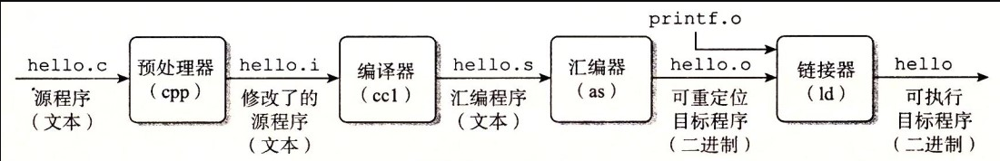
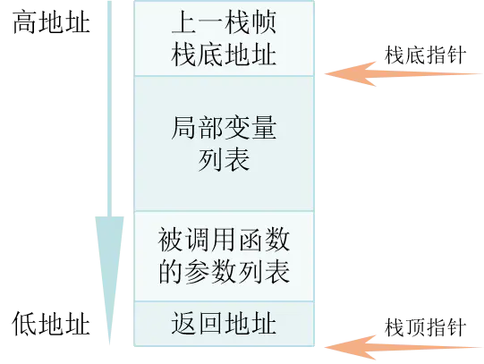

### 常考问题

---

#### 介绍面向对象三大特性

- 封装：将数据和代码绑在一起，避免外界干扰和不确定性的访问
- 继承：某种类型获得另外一种类型对象的属性和方法，可以使用现有类的所有功能，并在不需要重新编写原来的类的情况下对功能进行扩展
- 多态：即同一事物表现出不同事物的能力，父类指针指向子类对象。
  - 重载（静态多态）：指的是允许存在多个同名但是参数列表不同的函数
  - 重写（动态多态）：子类重新定义父类的虚函数

---

#### c++从代码到可执行经历了什么？



- 预编译
  - 展开所有的宏定义#define
  - 处理所有的条件预编译指令，如#if、#endif 等
  - 处理#inlcude预编译指令，将文件内容替换到它的位置，这个过程是递归的
  - 删除注释
  - 保留#pragma编译指令，防止有文件被重复引用
- 编译
  - 进行一系列的词法分析、语法分析语义分析以及优化等等，生产汇编代码文件
- 汇编
  - 将汇编代码翻译成可重定位目标文件
- 链接
  - 将可重定位目标文件和一些单独编译号的的目标文件进行链接合并，从而形成一个可以执行目标文件。分为「静态链接」和「动态链接」

> **知识补充**：
>
> - 可执行目标文件：可以直接在内存中执行；
> - 可重定位目标文件：可与其它可重定位目标文件在链接阶段合并，创建一个可执行目标文件；
> - 共享目标文件：这是一种特殊的可重定位目标文件，可以在运行时被动态加载进内存并链接；

---

#### 讲一讲静态链接和动态链接

- 「**静态链接**」：使用静态库的情况下，**在编译链接可执行文件时，链接器从库 中复制这些函数和数据并把它们和应用程序的其它模块组合起来创建最终的可执行文件**。

  - **空间浪费**：因为每个可执行程序中对所有需要的目标文件都要有一份副本，所以如果多个程序对同一个 目标文件都有依赖，会出现同一个目标文件存在多个副本；
  - 更新困难：每当库函数的代码修改了，这个时候就需要重新进行编译链接形成可执行程序。
  - **运行速度快**：但是静态链接的优点就是，在可执行程序中已经具备了所有执行程序所需要的任何东西， 在执行的时候运行速度快。

  >

- 「**动态链接**」：动态链接的基本思想是把程序按照模块拆分成各个相对独立部分，**在程序运行时才将它们链接在一起形 成一个完整的程序**，而不是像静态链接一样把所有程序模块都链接成一个单独的可执行文件。

  - 共享库：即使每个程序都依赖同一个库，该库不会像静态链接那样在内存中存在多份副本，而是这多个程序在执行时共享同一份副本。
  - 更新方便：更新时只需要替换原来的目标文件，而无需将所有的程序再重新链接一遍。
  - 性能损耗：因为把链接推迟到了程序运行时，所以每次执行程序都需要进行链接，所以性能会有一定损失。

  > 

> 说白了，静态链接的缺点就是动态链接的优化，其优点也是动态链接不具备的。

---

#### c++内存模型：

C++中，内存分成5个区，他们分别是堆、栈、全局/静态存储区和常量存储区和代码区。

- **代码段**:存放二进制代码。
- **文本段「常量段」**：存储程序中的一些字符串字面量，在程序中用于显示文字，只读
- **全局数据段**：全局变量和静态变量被分配到同一块内存中，在以前的C语言中，全局变量和静态变量又分为初始化的和未初始化的，在C++里面没有这个区分了，它们共同占用同一块内存区，在该区定义的变量若没有初始化，则会被自动初始化，例如int型变量自动初始为0。存放「静态变量」「全局变量」「常量」
- **堆区**：存储动态内存分配的内存块，比如new malloc，，是高地址增长的。程序结束后，操作系统会自动回收
- **栈区**：存储着该程序“上下文”，比如局部变量和函数的参数值等，由编译器自动分配释放。


---

#### 为什么c++实现多态时候要将父类[基类]的析构函数设置为虚析构函数？

> 将析构函数设为虚函数，是为了防止内存泄漏。

```
解释：如果存在用基类指针指向派生类对象，这样子可以使得基类和派生类的析构函数都被调用，不会造成内存泄漏。如果不把析构函数定义为虚函数，那么只会调用基类的析构函数。
```

---

#### 对比C和C++，讲讲两者的差别。

> 1. C++具有更严格的类型检查
>
>    ```cpp
>    char * p = malloc(10);//C语言中不报错，C++中会报错，不能进行隐式转换
>    ```
>
> 2. C++三目运算符返回的是左值,c语言返回的是右值
>
>    ```cpp
>    int a = 10,b = 20;
>    (a > b ? a : b) = 100;
>    cout<<b<<endl;//打印100
>    ```
>
> 3. C语言`const`为外部链接属性，C++默认为内部链接属性
>
> 4. C语言结构体不能写函数，C++可以,并且还可以不加`struct`关键字
>
> 5. C语言中内存申请用的是malloc，释放用的是free，C++分别是new和delete
>
> 6. C++允许函数重载，但是C语言不行
>
> 7. C++允许变量定义在程序的任何部分，但是C语言要求变量定义在函数开头部分。
>
> 8. C++多了引用
>
> 9. C++用try/catch/throw取代了C语言中的setjmp()和longjmp()函数

---

#### C++和java的区别

- java中没有指针，而是引入了真正的数组；C++中的数组其实底层是指针
- C++可以在其他系统运行，但是需要不同的编码；java仅仅需要一次编码就可以在各种系统下运行
- java的多态是基于接口实现的；C++是基于抽象类实现的。
- java没有多继承，但是可以实现多个接口；C++可以多继承，但是不建议
- C++用析构函数实现垃圾回收，java自动进行内存的分配和回收。
- java在Web应用开发上有着很大的优势相比C++，并且有着丰富的框架，开发的很快

---

#### C++编译器不能优化的情况：

> 自定义结构类型，编译器不能优化。
>
> 用变量给`const`修饰的局部变量赋值，编译器不能优化。


---

#### new/delete和malloc/free 有什么差别？

> 1. new 不需要计算大小；malloc需要手动计算分配的内存大小
>2. `malloc`返回一个`void*`指针，C++类型检查很严格，不允许将`void*`赋值给其他任何指针，必须进行强转。new 返回的是指定类型的指针。
> 3. `malloc`可能申请内存失败，所以必须判断返回值来确保内存分配成功。`new`操作符能确定在调用构造函数初始化之前内存分配是成功的，所有不用显式确定调用是否成功。
> 4. 使用`malloc/free`不会调用对象的构造函数和析构函数，`new/delete`会调用构造函数和析构函数。
> 5. 前者是c++的关键字；后者是库函数

> 建议:
>
> 1. 在删除指针后，立即把指针赋值为NULL，以免对它删除两次，对一些对象删除两次可能会产生某些问题。
> 2. `new/delete` 和 `malloc/free` 不能混搭使用。

`new`和`delete`在堆上创建、删除数组:

```cpp
int* pArr2 = new int[10]{ 1, 2, 3, 4, 5, 6, 7, 8, 9, 10 };
delete[] pArr2; //[]在前！
```

> 当创建一个对象数组的时候，必须对数组中的每一个对象调用构造函数

> 如果对一个`void*`指针执行`delete`操作，这将可能成为一个程序错误，除非指针指向的内容是非常简单的，因为它将不执行析构函数
>
> ```cpp
> void * m = new classA;
> delete m;//不会调用析构函数，从而造成内存泄露
> ```
>
> 这是因为`静态联编`的编译方式，在编译阶段，编译器已经确定了函数的调用地址，C++不认识`void*`，不知道`void *`指向哪个函数，所以不会调用析构函数。

---

#### 重写、重载、重定义（隐藏）的区别

> 重载：同一作用域的同名函数
>
> 1. 同一个作用域
> 2. 参数个数，参数顺序，参数类型不同，和函数返回值没有关系
> 4. `const`也可以作为重载条件`do(const Teacher& t){} do(Teacher& t){}`
> 
>重写(覆盖)：
> 
>1. 有继承
> 2. 子类（派生类）重写父类（基类）的虚函数
> 3. 函数返回值，函数名字，函数参数，必须和基类中的虚函数一致
> 
>重定义（隐藏）
> 
>1. 有继承
> 2. 子类（派生类）重新定义父类（基类）的同名成员（非虚函数）

---

#### 在main执行之前和之后执行的代码可能是什么？

**main函数之前**：

- 设置栈指针
- 初始化静态`static`变量和`global`全局变量，即`.data`段的内容
- 将未初始化部分的全局变量赋初值：数值型`short`，`int`，`long`等为`0`，`bool`为`FALSE`，指针为`NULL`等等，即`.bss`段的内容
- 全局对象初始化，在`main`之前调用构造函数，这是可能会执行前的一些代码
- 将main函数的参数`argc`，`argv`等传递给`main`函数，然后才真正运行`main`函数
- `__attribute__((constructor))`：会在main函数执行之前被自动的执行【对于我们初始化一些在程序中使用的数据非常有用.】

**main函数执行之后**：

- 全局对象的析构函数会在main函数之后执行；
- 可以用 **`atexit`** 注册一个函数，它会在main 之后执行;
- `__attribute__((destructor))`：会在main（）函数执行之后或者exit（）被调用后被自动的执行。

---

#### c++中new的类型

- plain new：普通的new，分配内存失败会抛出异常，而不是null
- nothrow new：分配内存失败不抛出异常，而是null
- placement new：允许在一块已经分配成功的内存上重新构造对象或对象数组。placement new不用担心内存分配失败，因为它根本不分配内存，它做的唯一一件事情就是调用对象的构造函数。
  - palcement new的主要用途就是反复使用一块较大的动态分配的内存来构造不同类型的对象或者他们的数组
  - placement new构造起来的对象数组，要显式的调用他们的析构函数来销毁（析构函数并不释放对象的内存），千万不要使用delete，这是因为placement new构造起来的对象或数组大小并不一定等于原来分配的内存大小，使用delete会造成内存泄漏或者之后释放内存时出现运行时错误。

```cpp
#include <iostream>
#include <string>
using namespace std;
class ADT{
	int i;
	int j;
public:
	ADT(){
		i = 10;
		j = 100;
		cout << "ADT construct i=" << i << "j="<<j <<endl;
	}
	~ADT(){
		cout << "ADT destruct" << endl;
	}
};
int main()
{
	char *p = new(nothrow) char[sizeof ADT + 1];
	if (p == NULL) {
		cout << "alloc failed" << endl;
	}
	ADT *q = new(p) ADT;  //placement new:不必担心失败，只要p所指对象的的空间足够ADT创建即可
	//delete q;//错误!不能在此处调用delete q;
	q->ADT::~ADT();//显示调用析构函数
	delete[] p;
	return 0;
}

//输出结果：
//ADT construct i=10j=100
//ADT destruct
```

---

#### static的用法和作用

- 隐藏：当同时编译多个文件时，所有未加static前缀的全局变量或全局函数都具有全局性。如果加了static就会对其他源文件隐藏。利用这一特性可以在不同文件中定义同文函数和变量。

- 保持变量内容的持久：如果一个局部变量被static修饰，那么它的生存期将会为整个源程序 ，但是作用域仍然在当前函数内。

- 默认初始化为0：被static修饰的变量存储在静态数据区，内存中所有的字节默认都是0x00（全局变量也在静态数据区）

- 修饰类成员对象：

  - 静态成员变量：被static修饰的成员变量不属于某个对象，而是属于类，静态数据成员要在类体外初始化，静态数据成员可以通过对象名引用，也可以通过类名来引用。静态数据成员的作用域只限于定义该类的作用域内。

  - 静态成员函数：静态成员函数也是类的一部分，而不是对象的一部分，静态成员函数的作用不是为了对象之间的沟通，而是为了能够处理静态数据成员。静态成员函数并不属于某一对象，它与任何对象都无关，因此静态成员函数没有this指针。因此，就无法对一个对象中的非静态成员进行默认访问（即在引用数据成员时不指定对象名）。

    > 静态成员函数不能被声明为const（将成员函数声明为const就是承诺不会修改该函数所属的对象）。静态成员函数也不能被声明为虚函数。

---

#### 全局变量和static变量的区别

全局变量之前再冠以static就构成了静态的全局变量。

- 非静态全局变量的作用域是整个源程序，当一个源程序由多个原文件组成时，非静态的全局变量在各个源文件中都是有效的。

  静态全局变量则限制了其作用域，即只在定义该变量的源文件内有效，在同一源程序的其它源文件中不能使用它。

  > 由于静态全局变量的作用域限于一个源文件内，只能为该源文件内的函数公用，因此可以避免在其他源文件中引起错误。

- static全局变量与普通的全局变量的区别是static全局变量只初始化一次，防止在其他文件单元被引用。

---

#### const关键字的作用

- 防止一个变量被改变，在定义该const变量时，通常需要对其进行初始化

- 作用于指针，可以指定指针指向的数据是常量，也可以指定指针是常量，或者两者兼之

- 修饰函数声明中的形参时，表面输入的参数在函数内部不可以被改变

- 修饰类的成员函数时，表明该函数是一个常函数，不能修改非mutalb的成员变量；如果有时候必须指定其返回值为const，使得返回值不能为左值

  > 1. const成员函数可以访问非const对象的非const数据成员、const数据成员，**也可以访问const对象内的所有数据成员；**
  > 2. 非const成员函数可以访问非const对象的非const数据成员、const数据成员，**但不可以访问const对象的任意数据成员；**
  > 3. const对象只能调用const成员函数。

- 修饰类的成员变量时，不能在类外部进行定义，只能通过构造函数初始化列表进行初始化，并且必须有构造函数，不能在类声明中进行初始化。

> 注意：只有引用传递和指针传递可以用是否加const来重载。

---

#### 指针和引用的区别：

- 指针是一个变量，存储的是一个地址；引用相当于是一个变量的别名
- 指针可以有多级；引用只能有一级
- 指针可以为null，并且在定义时不一定非要初始化；但是引用不能为空，并且必须在定义时初始化
- 指针初始化后可以改变指向；但是引用初始化后不能改变（因为引用底层就是一个指针常量）
- 对指针进行sizeof得到的是指针的大小；对引用进行sizeof得到的是变量所占内存的大小
- 指针作为参数进行传递时，也是将实惨进行了一个拷贝，两者指向同一个地址，在函数内改变指针指向不影响实参，但是引用可以

---

#### 传递参数时，什么时候用引用，什么时候用指针，什么时候直接值传递？

如果只使用传递过来的值，而不进行修改：

- 数据对象很小（内置数据类型或小型结构），使用按值传递
- 数据对象是数组，使用指向const的指针
- 数据对象是较大的结构，使用const指针或者const引用
- 数据对象是类对象，使用const引用

如果需要进行修改：

- 内置数据类型，使用指针
- 数据对象是数组，使用指针
- 数据对象是结构，使用指针或者引用
- 数据对象是类对象，使用引用

---

#### 堆和栈的区别

- 堆是由使用者自己进行申请和释放的（容易产生内存泄露）；栈是由系统进行自动分配
- 堆默认是 1G～4G；栈默认是4M
- 堆的效率没有栈高（因为计算机在底层对栈提供支持，分配了专门的寄存器存放栈地址），堆分配的内存不是连续的（系统是用链表来存储空闲内存地址），会产生内存碎片，但是栈不会
- 堆向高地址扩展，栈向低地址扩展；

---

#### 区别一下指针类型

```cpp
int *p[10];   // 指针数组：数组中的每一个元素都是指针
int (*p)[10]; // 数组指针：指针指向的类型是一个数组int[10]
int *p(int);  // 函数声明：函数名是p，参数是int类型的，返回值是int *类型的
int (*p)(int);// 函数指针：指向的类型是返回值为int，输入参数为一个int的函数
const int * p;// 常量指针：指向的是一个常量，不能修改其值，但是可以改变指针指向
int const * p;// 常量指针：
int * const p;// 指针常量：不可以改变指针指向，但是可以改变指针指向的值
const int* const p; // 指向常量的常指针：不可以改变指针指向，也不可以改变指针指向的值
```


---

#### 被free回收的内存是立即返回给操作系统吗？

不是的，被free回收的内存会被ptmalloc使用双向链表保存起来，当用户下一次申请内存的时候，会尝试从这些内存中寻找，如果找到合适的直接返回，避免频繁的系统的调用，占用过多的资源。

---

#### 宏定义#define和typedef有什么区别？

- 宏定义只是简单地替换，typedef是对类型起别名
- 宏定义发生在编译前的预处理阶段，typedef发生在编译阶段
- 宏定义不进行类型检查；typedef会进行数据类型检查
- 宏定义不是一个语句，后面不用加分号；typedef是语句，需要加分号

---

#### define和const的区别

- 宏定义仅仅是简单的替换，不做类型检查；但是const，编译器可以对其进行类型检查
- 宏定义发生在编译之前，但是const作用发生在编译阶段
- 宏定义是直接替换，不会分配内存，存储于程序的代码段中；const常量需要进行内存分配，存储于程序的数据段中

---

#### 变量声明和定义的区别？

- 声明不分配内存，仅仅是把变量声明的位置和类型提供给编译器，定义才分配内存。
- 一个变量可以多处声明（extern），但是只能在一处定义；

---

#### sizeof和strlen的区别？

- sizeof是关键字，strlen是函数
- sizeof参数可以是任何数据的类型或者数据（sizeof参数不退化）；strlen的参数只能是字符指针且结尾是'\0'的字符串。

---

#### 一个指针占多少个字节？

一个指针占内存的大小跟编译环境有关，32位环境下，指针占用大小为4字节，在64位的编译环境下的，指针的占用大小为8字节。

---

#### 数组a[]中&a和a的区别？

a和&a的值是一样的，但是意义有所区别，a指的是a[0]的地址，&a指的是数组a的地址（“数组名”代表数组第一个元素的地址，“&数组名”代表的是整个数组的地址）

a+1 = a[0]的地址+sizeof(int);(在第一个元素的地址上便宜一个数组元素的大小，即下一个元素，a[1]的地址。)

&a+1 = 数组a的地址+sizeof(a);（在数组的地址上偏移一个数组的大小，此时sizeof(a）中的a是一个数组，不是一个指针，计算出来是一个数组的大小，不是指针的大小）

> &a`的类型是`int(*)[ ],即指向数组的指针

---

#### C++中struct和class的异同

相同点：

- 两者都拥有成员函数，公有和私有部分

不同点：

- struct的成员默认是公有，class默认是私有
- struct的继承默认是公有，class默认是私有

---

#### C和C++中struct的区别

- C中不支持成员函数定义，但是C++支持成员函数定义
- C中的struct没有权限设置，仅仅是变量的集合体，而C++中的struc的成员变量可以设置权限
- C中声明结构体需要用到typedef，而C++不用

---

#### 数组名和指针（这里为指向数组首元素的指针）的区别

- 二者均可通过增减偏移量来访问数组中的元素。
- 数组名不是真正意义上的指针，可以理解为常指针，所以数组名没有自增、自减等操作。
- 当数组名当做形参传递给调用函数后，就失去了原有特性，退化成一般指针，多了自增、自减操作，但sizeof运算符不能再得到原数组的大小了。

---

#### final和override关键字

final：阻止类的进一步派生 和 虚函数的进一步重写。

override：保证在派生类中声明的重载函数，与基类的虚函数有相同的签名；

> 比如在重写时一步小心打错了，那么编译器就把它当作新的虚函数了，就不会报错，所以加上override比较好

---

#### extern"C"的用法

在程序中加上extern "C"后，相当于告诉编译器这部分代码是C语言写的，因此要按照C语言进行编译，而不是C++

如下情况使用：

（1）C++代码中调用C语言代码；

（2）在C++中的头文件中使用；

（3）在多个人协同开发时，可能有人擅长C语言，而有人擅长C++；

---

#### 什么是野指针，什么是悬空指针？

野指针：没有初始化的指针

悬空指针：指针指向的内存已经被释放了的指针

**产生原因及解决办法：**

野指针：指针变量未及时初始化 => 定义指针变量及时初始化，要么置空。

悬空指针：指针free或delete之后没有及时置空 => 释放操作后立即置空。

---

#### C++有几种构造函数

- 默认构造函数
- 拷贝构造函数
- 初始化构造函数
- 转换构造函数

---

#### 深拷贝和浅拷贝的区别

浅拷贝：浅拷贝只是拷贝了一个指针，并没有开辟一个新的地址，拷贝的指针和原指针直线指向同一块地址。

深拷贝：深拷贝不仅拷贝值，还开辟出了一块新的空间来存放新的值，两者互不影响。

---

#### 内联函数和宏定义的区别

- 宏定义只是简单的字符串替换，不会进行类型检查；但是内联函数会在编译阶段进行类型检查
- 宏定义书写容易产生bug和歧义；内联函数不会
- 内联函数是在编译时把用到的函数代码嵌入到目标代码当中，省去了函数调用的开销，但是仅仅是建议编译器，不能保证内联

---

#### 什么是大小端存储？如何鉴别？

大端存储：高字节存储在低地址中

小端存储：低字节存储在低地址中

```cpp
#include <iostream>
using namespace std;
int main()
{
    int a = 0x1234;
    //由于int和char的长度不同，借助int型转换成char型，只会留下低地址的部分
    char c = (char)(a);
    if (c == 0x12)
        cout << "big endian" << endl;
    else if(c == 0x34)
        cout << "little endian" << endl;
}
```

---

#### volatile的用法

volatile 关键字是一种类型修饰符，遇到这个关键字声明的变量，编译器对访问该变量的代码就不再进行优化。

**volatile定义变量的值是易变的，每次用到这个变量的值的时候都要去重新读取这个变量的值，而不是读寄存器内的备份。**多线程中被几个任务共享的变量需要定义为volatile类型。

---

#### mutable的用法

mutable也是为了突破const的限制而设置的。被mutable修饰的变量，将永远处于可变的状态，即使在一个const函数中。

---

#### explicit的用法

explicit关键字用来修饰类的构造函数，被修饰的构造函数的类，不能发生相应的隐式类型转换，只能以**显示的方式进行类型转换**

- explicit 关键字只能用于类内部的构造函数声明上
- explicit 关键字作用于单个参数的构造函数
- 被explicit修饰的构造函数的类，不能发生相应的隐式类型转换

---

#### 静态变量什么时候初始化

静态局部变量和全局变量一样，数据都存放在全局区域，所以在主程序之前，编译器已经为其分配好了内存，但在C和C++中静态局部变量的初始化节点又有点不太一样。（也就是编译阶段分配内存）

- 在C中，初始化发生在代码执行之前，编译阶段分配好内存之后，就会进行初始化，所以我们看到在C语言中无法使用变量对静态局部变量进行初始化，在程序运行结束，变量所处的全局内存会被全部回收。
- 而在C++中，初始化时在执行相关代码时才会进行初始化，主要是由于C++引入对象后，要进行初始化必须执行相应构造函数和析构函数，在构造函数或析构函数中经常会需要进行某些程序中需要进行的特定操作，并非简单地分配内存。（也就是说首次用到时进行初始化）

---

#### 类成员初始化方式有哪些？为什么成员初始化列表会快一点？

- 赋值初始化
- 成员列表初始化

对于赋值初始化，是在所有的数据成员被分配内存空间后才进行的。

列表初始化是给数据成员分配内存空间时就进行初始化。就是说分配一个数据成员只要冒号后有此数据成员的赋值表达式(此表达式必须是括号赋值表达式),那么分配了内存空间后在进入函数体之前给数据成员赋值，就是说初始化这个数据成员此时函数体还未执行。

---

#### 哪些情况必须使用成员初始化列表

- 初始化一个引用成员时
- 初始化一个常量成员时
- 当调用一个基类的构造函数，而他拥有一组参数时
- 当调用一个成员类的构造函数，而他拥有一组参数时

---

#### 构造函数的执行顺序

1. 虚拟基类的构造函数（多个虚拟基类则按照继承的顺序执行构造函数）。
2. 基类的构造函数（多个普通基类也按照继承的顺序执行构造函数）。
3. 类类型的成员对象的构造函数（按照初始化顺序）
4. 派生类自己的构造函数。

---

#### 什么是内存泄露？如何避免与检测？

用malloc或者new在堆上申请内存时，使用完后忘记释放了，就是内存泄漏。

**避免方式**：

- 用一个全局变量来计数
- 将基类的析构函数声明为虚函数
- 对象数组释放要用delete[]
- new和delete、malloc和free成对出现

**检测工具**：

- linux下Valgrind
- win下crt库

---

#### 什么是移动构造函数？

拷贝构造函数过程中，我们一般是需要新申请一块内存，然后让指针指向该内存，但是如果指针指向的内存非常大的话，则拷贝构造函数的代价就非常昂贵，会极大地影响性能。C++11提供一种简洁解决方法：移动构造函数,即是在用原对象指针对新对象指针进行赋值后,将原对象成员指针置为空指针,使得其无法指向内存数据,从而保证在析构的时候不会产生内存泄漏。这样既不用分配新内存,也不会产生内存泄漏,从而很好地解决了上述问题。

---

#### 静态类型和动态类型，静态绑定和动态绑定

- 静态类型：对象在声明时采用的类型，在编译期既已确定；
- 动态类型：通常是指一个指针或引用目前所指对象的类型，是在运行期决定的；
- 静态绑定：绑定的是静态类型，所对应的函数或属性依赖于对象的静态类型，发生在编译期；
- 动态绑定：绑定的是动态类型，所对应的函数或属性依赖于对象的动态类型，发生在运行期；

> 非虚函数一般都是静态绑定，而虚函数都是动态绑定（如此才可实现多态性）

```cpp
#include <iostream>
using namespace std;

class A
{
public:
	/*virtual*/ void func() { std::cout << "A::func()\n"; }
};

class B : public A
{
public:
	void func() { std::cout << "B::func()\n"; }
};

class C : public A 
{
public:
	void func() { std::cout << "C::func()\n"; }
};

int main()
{
	C* pc = new C(); //pc的静态类型是它声明的类型C*，动态类型也是C*；
	B* pb = new B(); //pb的静态类型和动态类型也都是B*；
	A* pa = pc;      //pa的静态类型是它声明的类型A*，动态类型是pa所指向的对象pc的类型C*；
	pa = pb;         //pa的动态类型可以更改，现在它的动态类型是B*，但其静态类型仍是声明时候的A*；
	C *pnull = NULL; //pnull的静态类型是它声明的类型C*,没有动态类型，因为它指向了NULL；
    
  pa->func();      //A::func() pa的静态类型永远都是A*，不管其指向的是哪个子类，都是直接调用 A::func()；
	pc->func();      //C::func() pc的动、静态类型都是C*，因此调用C::func()；
	pnull->func();   //C::func() 不用奇怪为什么空指针也可以调用函数，因为这在编译期就确定了，和指针空不空没关系；
	return 0;
}
```

如果将A类中的virtual注释去掉，则运行结果是：

```cpp
pa->func();    //B::func() 因为有了virtual虚函数特性，pa的动态类型指向B*，因此先在B中查找，找到后直接调用；
pc->func();    //C::func() pc的动、静态类型都是C*，因此也是先在C中查找；
pnull->func(); //空指针异常，因为是func是virtual函数，因此对func的调用只能等到运行期才能确定，然后才发现pnull是空指针；
```

总结静态绑定和动态绑定的区别：

- 静态绑定发生在编译期，动态绑定发生在运行期；
- 对象的动态类型可以更改，但是静态类型无法更改；
- 要想实现动态，必须使用动态绑定；
- 在继承体系中只有虚函数使用的是动态绑定，其他的全部是静态绑定；

---

#### 引用能够实现动态绑定吗？为什么可以？

可以。引用在创建的时候必须初始化，在访问虚函数时，编译器会根据其所绑定的对象类型决定要调用哪个函数。注意只能调用虚函数。

指针或引用（本质也是一个指针）是在运行期根据他们绑定的具体对象确定

---

#### 全局变量和局部变量的区别

- 生命周期不同：全局变量在整个程序中存在，局部变量在函数内不，随着函数结束或者代码块结束就被销毁
- 存储位置不同：全局变量在**全局数据段**，局部变量在**堆栈区**

---

#### 指针的加减注意什么？

指针加减本质是对其所指地址的移动，移动的步长跟指针的类型是有关系的，因此在涉及到指针加减运算需要十分小心，加多或者减多都会导致指针指向一块未知的内存地址，如果再进行操作就会很危险。

```cpp
#include <iostream>
using namespace std;

int main()
{
	int *a, *b, c;
	a = (int*)0x500;
	b = (int*)0x520;
	c = b - a;
	printf("%d\n", c); // 8
	a += 0x020;
	c = b - a;
	printf("%d\n", c); // -24
	return 0;
}
```

> 首先变量a和b都是以16进制的形式初始化，将它们转成10进制分别是1280（5 * 16^2=1280）和1312（5 * 16^2+2 * 16=1312)， 那么它们的差值为32，也就是说a和b所指向的地址之间间隔32个位，但是考虑到是int类型占4位，所以c的值为32/4=8
>
> a自增16进制0x20之后，其实际地址变为1280 + 2*16*4 = 1408，（因为一个int占4位，所以要乘4），这样它们的差值就变成了1312 - 1280 = -96，所以c的值就变成了-96/4 = -24
>
> 遇到指针的计算，**需要明确的是指针每移动一位，它实际跨越的内存间隔是指针类型的长度，建议都转成10进制计算，计算结果除以类型长度取得结果**

---

#### 简单介绍下栈帧？

栈能够为函数运行分配足够的空间资源，这种资源便称为栈帧。

- 栈帧的分配是从高地址向低地址逐步执行的。

- 一个栈帧大小不是无限的，其最靠近低地址的一端称为栈顶，最接近高地址的一端称为栈底，栈顶地址和栈底地址各自保存在专门的寄存器里边，这两个专门的寄存器存放的值都是地址，故亦可分别称之为栈顶指针、栈底指针。

  > 堆栈指针寄存器esp存放栈帧的栈顶地址，基址寄存器ebp存放栈帧的栈底地址

- 一个栈帧栈底地址减去栈顶地址所得的值决定了该栈帧的大小，可以通过让栈顶指针自增与自减分别控制栈帧的缩小与扩大。

一个函数栈帧的结构如图所示



---

#### 简述方法调用原理

- 函数A被调用时，汇编调用call指令
- 将上一帧（即A函数调用方）的栈底地址压栈
- 修正堆栈寄存器esp（保存了栈顶地址）值，32位减4，64位减8
- 然后将此刻的栈顶地址保存到基址寄存器ebp中。
- 然后就是函数参数入栈（从右向左，因为这样可以动态变化参数个数）、函数返回值、局部变量入栈
- A函数执行结束时，就开始不断的出栈，取出保存在栈中的寄存器数值并将寄存器的值也恢复到了函数调用之前，并取回函数返回地址，函数返回。

---

#### c++中指针参数传递和引用参数传递有什么区别？

- 指针参数传递本质上是值传递，它所传递的是一个地址值。值传递过程中，被调函数的形式参数作为被调函数的局部变量处理，会**在栈中开辟内存空间以存放由主调函数传递进来的实参值，从而形成了实参的一个副本（替身）**。值传递的特点是，被调函数对形式参数的任何操作都是作为局部变量进行的，不会影响主调函数的实参变量的值（形参指针变了，实参指针不会变）。
- 引用参数传递过程中，被调函数的形式参数也作为局部变量在栈中开辟了内存空间，但是这时**存放的是由主调函数放进来的实参变量的地址。**被调函数对形参（本体）的任何操作都被处理成间接寻址，即通过栈中存放的地址访问主调函数中的实参变量（根据别名找到主调函数中的本体）。因此，被调函数对形参的任何操作都会影响主调函数中的实参变量。

不同点：

- 引用传递和指针传递是不同的，虽然他们都是在被调函数栈空间上的一个局部变量，但是任何对于引用参数的处理都会通过一个间接寻址的方式操作到主调函数中的相关变量。而对于指针传递的参数，如果改变被调函数中的指针地址，它将应用不到主调函数的相关变量。如果想通过指针参数传递来改变主调函数中的相关变量（地址），那就得使用指向指针的指针或者指针引用。

---

#### 类如何实现只能静态分配和只能动态分配

前者是把new、delete运算符重载为private属性。后者是把构造、析构函数设为protected属性，再用子类来动态创建

---

#### 继承机制中对象之间如何转换？指针和引用之间如何转换？

- 向上类型转换：将派生类指针或引用转换为基类的指针或引用被称为向上类型转换，向上类型转换会自动进行，而且向上类型转换是安全的。
- 向下类型转换：将基类指针或引用转换为派生类指针或引用被称为向下类型转换，向下类型转换不会自动进行，因为一个基类对应几个派生类，所以向下类型转换时不知道对应哪个派生类，所以在向下类型转换时必须加动态类型识别技术。RTTI技术，用dynamic_cast进行向下类型转换。

---

#### 说说你理解的内存对齐

- 分配内存的顺序是按照声明的顺序
- 最后整个结构体的大小必须是里面变量类型最大值的整数倍
- 每个变量相对于起始位置的偏移量必须是该变量类型大小的整数倍，不是整数倍空出内存，直到偏移量是整数倍为止

---

#### 函数重载匹配的原则和顺序是什么？

- 将所有同名函数作为候选者
- 尝试寻找可行的候选者
  - 精确匹配实参类型
  - 通过默认参数能够匹配实参类型
  - 通过默认类型转换匹配实参

---

#### 静态成员与普通成员的区别是什么？

- 生命周期
  - 静态成员变量从类被加载开始到类被卸载，一直存在
  - 普通成员变量只有在类创建对象后才开始存在，对象结束，它的生命期结束；
- 共享方式
  - 静态成员变量是全类共享
  - 普通成员变量是每个对象单独享用的；
- 定义位置
  - 普通成员变量存储在栈或堆中
  - 静态成员变量存储在静态全局区；
- 初始化位置
  - 普通成员变量在类中初始化；
  - 静态成员变量在类外初始化；

---

#### 如何阻止一个类被实例化？

将类定义为抽象类或者构造函数私有化

---

#### static_cast相比c语言的转换好在哪里？

- 更加安全
- 更直接明显

---

#### 什么是回调函数？有什么作用？

当发生某种事件时，系统或其他函数将会自动调用你定义的一段函数；回调函数就是一个通过函数指针调用的函数。如果你把函数的指针（地址）作为参数传递给另一个函数，当这个指针被用为调用它所指向的函数时，我们就说这是回调函数；

---

#### 介绍一些几种经典的锁

- 读写锁

  - 可以同时读
  - 读时不能写
  - 写时不能读和写
  - 写优先于读

- 互斥锁：一次只能一个线程拥有互斥锁，其他线程只有等待

- 条件变量：互斥锁一个明显的缺点是他只有两种状态：锁定和非锁定。而条件变量通过允许线程阻塞和等待另一个线程发送信号的方法弥补了互斥锁的不足，他常和互斥锁一起使用，以免出现竞态条件。当条件不满足时，线程往往解开相应的互斥锁并阻塞线程然后等待条件发生变化。一旦其他的某个线程改变了条件变量，他将通知相应的条件变量唤醒一个或多个正被此条件变量阻塞的线程。

  > 互斥：同一个资源同一时间只有一个访问者可以进行访问，其他访问者需要等前一个访问者访问结束才可以开始访问该资源。但互斥无法限制访问者对资源的访问顺序，即访问是无序的。
  >
  > 同步：分布在不同进程之间的若干程序片断，它们的运行必须严格按照规定的某种先后次序来运行，这种先后次序依赖于要完成的特定的任务。所以同步就是在互斥的基础上，通过其它机制实现访问者对资源的有序访问。
  >
  > 总结：同步是一种更为复杂的互斥，而互斥是一种特殊的同步。

- 自旋锁:如果进线程无法取得锁，进线程不会立刻放弃CPU时间片，而是一直循环尝试获取锁，直到获取为止。如果别的线程长时期占有锁那么自旋就是在浪费CPU做无用功，但是自旋锁一般应用于加锁时间很短的场景，这个时候效率比较高。

---

#### 类的对象存储空间

- 非静态成员的数据类型大小之和

  > 静态成员不占据类的空间

- 编译器加入的额外成员变量（如指向虚函数表的指针）

- 为了边缘对齐优化加入的padding

---

#### 关于this指针你知道什么？全说出来。

- this指针是类的指针，指向对象的首地址。

- this指针只能在成员函数中使用，在全局函数、静态成员函数中都不能用this。

  > 当在类的**非静态成员函数**中访问类的**非静态成员**的时候，编译器会自动将对象本身的地址作为一个隐含参数传递给函数。

- this指针只有在成员函数中才有定义，且存储位置会因编译器不同有不同存储位置。

- 一个对象的this指针并不是对象本身的一部分，不会影响 sizeof(对象) 的结果。

- this指针在成员函数执行前构造，在成员函数执行后消除

- 

this指针作用：

- 在类的非静态成员函数中返回类对象本身的时候，直接使用 return *this；
- 当形参数与成员变量名相同时用于区分，如this->n = n （不能写成n = n）

---

#### 空类大小是多少？

- C++空类的大小不为0，不同编译器设置不一样，vs设置为1；

  > C++中空类会占一个字节，这是为了让对象的实例能够相互区别。因为如果不给内存的话，就没有地址了，就分辨不了不同空类对象了

- 带有虚函数的C++空类大小不为1，因为每一个对象会有一个vptr指向虚函数表，具体大小根据指针大小确定；

---

#### c++新特性有哪些？

- nullptr替代了NULL

- 引入了 auto 和 decltype 这两个关键字实现了类型推导

  - **auto 让编译器通过初始值来进行类型推演。从而获得定义变量的类型，所以说 auto 定义的变量必须有初始值。**

    ```cpp
    //普通；类型
    int a = 1, b = 3;
    auto c = a + b;// c为int型
    
    //const类型
    const int i = 5;
    auto j = i; // 变量i是顶层const, 会被忽略, 所以j的类型是int
    auto k = &i; // 变量i是一个常量, 对常量取地址是一种底层const, 所以k的类型是const int*
    const auto l = i; //如果希望推断出的类型是顶层const的, 那么就需要在auto前面加上cosnt
    
    //引用和指针类型
    int x = 2;
    int& y = x;
    auto z = y; //z是int型不是int& 型
    auto& p1 = y; //p1是int&型
    auto p2 = &x; //p2是指针类型int*
    ```

    有的时候我们还会遇到这种情况，**我们希望从表达式中推断出要定义变量的类型，但却不想用表达式的值去初始化变量。**还有可能是函数的返回类型为某表达式的值类型。在这些时候auto显得就无力了，所以C++11又引入了第二种类型说明符decltype

  - decltype：**选择并返回操作数的数据类型。在此过程中，编译器只是分析表达式并得到它的类型，却不进行实际的计算表达式的值。**

    ```cpp
    int func() {return 0};
    
    //普通类型
    decltype(func()) sum = 5; // sum的类型是函数func()的返回值的类型int, 但是这时不会实际调用函数func()
    int a = 0;
    decltype(a) b = 4; // a的类型是int, 所以b的类型也是int
    
    //不论是顶层const还是底层const, decltype都会保留   
    const int c = 3;
    decltype(c) d = c; // d的类型和c是一样的, 都是顶层const
    int e = 4;
    const int* f = &e; // f是底层const
    decltype(f) g = f; // g也是底层const
    
    //引用与指针类型
    //1. 如果表达式是引用类型, 那么decltype的类型也是引用
    const int i = 3, &j = i;
    decltype(j) k = 5; // k的类型是 const int&
    
    //2. 如果表达式是引用类型, 但是想要得到这个引用所指向的类型, 需要修改表达式:
    int i = 3, &r = i;
    decltype(r + 0) t = 5; // 此时是int类型
    
    //3. 对指针的解引用操作返回的是引用类型
    int i = 3, j = 6, *p = &i;
    decltype(*p) c = j; // c是int&类型, c和j绑定在一起
    
    //4. 如果一个表达式的类型不是引用, 但是我们需要推断出引用, 那么可以加上一对括号, 就变成了引用类型了
    int i = 3;
    decltype((i)) j = i; // 此时j的类型是int&类型, j和i绑定在了一起
    ```

  - decltype(auto)：使用时，会将“=”号左边的表达式替换掉auto，再根据decltype的语法规则来确定类型。

    ```cpp
    int e = 4;
    const int* f = &e; // f是底层const
    decltype(auto) j = f;//j的类型是const int* 并且指向的是e
    ```

- 基于范围的 for 循环 for(auto& i : res){}

- 类和结构体的中初始化列表

- Lambda 表达式（匿名函数）

- 右值引用和move语义

- 智能指针：智能指针是一个类，用来存储指向动态分配对象的指针，负责自动释放动态分配的对象，防止堆内存泄漏。动态分配的资源，交给一个类对象去管理，当类对象声明周期结束时，自动调用析构函数释放资源

  - **shared_ptr**：采用引用计数器的方法，允许多个智能指针指向同一个对象，每当多一个指针指向该对象时，指向该对象的所有智能指针内部的引用计数加1，每当减少一个智能指针指向对象时，引用计数会减1，当计数为0的时候会自动的释放动态分配的资源。

    > 代码实现：
    >
    > ```cpp
    > template<typename T>
    > class SharedPtr
    > {
    > public:
    > 	SharedPtr(T* ptr = NULL):_ptr(ptr), _pcount(new int(1))
    > 	{}
    > 
    > 	SharedPtr(const SharedPtr& s):_ptr(s._ptr), _pcount(s._pcount){
    > 		(*_pcount)++;
    > 	}
    > 
    > 	SharedPtr<T>& operator=(const SharedPtr& s){
    > 		if (this != &s)
    > 		{
    > 			if (--(*(this->_pcount)) == 0)
    > 			{
    > 				delete this->_ptr;
    > 				delete this->_pcount;
    > 			}
    > 			_ptr = s._ptr;
    > 			_pcount = s._pcount;
    > 			*(_pcount)++;
    > 		}
    > 		return *this;
    > 	}
    > 	T& operator*()
    > 	{
    > 		return *(this->_ptr);
    > 	}
    > 	T* operator->()
    > 	{
    > 		return this->_ptr;
    > 	}
    > 	~SharedPtr()
    > 	{
    > 		--(*(this->_pcount));
    > 		if (*(this->_pcount) == 0)
    > 		{
    > 			delete _ptr;
    > 			_ptr = NULL;
    > 			delete _pcount;
    > 			_pcount = NULL;
    > 		}
    > 	}
    > private:
    > 	T* _ptr;
    > 	int* _pcount;//指向引用计数的指针
    > };
    > ```
    >
    > 

  - **unique_ptr**：unique_ptr采用的是独享所有权语义，一个非空的unique_ptr总是拥有它所指向的资源。

  - **weak_ptr**：弱引用。 引用计数有一个问题就是互相引用形成环（环形引用），这样两个指针指向的内存都无法释放。需要使用weak_ptr打破环形引用。weak_ptr是一个弱引用，它是为了配合shared_ptr而引入的一种智能指针，它指向一个由shared_ptr管理的对象而不影响所指对象的生命周期，也就是说，它只引用，不计数。如果一块内存被shared_ptr和weak_ptr同时引用，当所有shared_ptr析构了之后，不管还有没有weak_ptr引用该内存，内存也会被释放。所以weak_ptr不保证它指向的内存一定是有效的，在使用之前使用函数lock()检查weak_ptr是否为空指针。

  - **auto_ptr**

    主要是为了解决“有异常抛出时发生内存泄漏”的问题 。因为发生异常而无法正常释放内存。

智能指针的循环引用问题：

```cpp
#include <iostream>
using namespace std;

template <typename T>
class Node
{
public:
	Node(const T& value)
		:_pPre(NULL)
		, _pNext(NULL)
		, _value(value)
	{
		cout << "Node()" << endl;
	}
	~Node()
	{
		cout << "~Node()" << endl;
		cout << "this:" << this << endl;
	}

	shared_ptr<Node<T>> _pPre;
	shared_ptr<Node<T>> _pNext;
	T _value;
};

void Funtest()
{
	shared_ptr<Node<int>> sp1(new Node<int>(1));
	shared_ptr<Node<int>> sp2(new Node<int>(2));

	cout << "sp1.use_count:" << sp1.use_count() << endl;
	cout << "sp2.use_count:" << sp2.use_count() << endl;

	sp1->_pNext = sp2; //sp2的引用+1
	sp2->_pPre = sp1; //sp1的引用+1

	cout << "sp1.use_count:" << sp1.use_count() << endl;
	cout << "sp2.use_count:" << sp2.use_count() << endl;
}
int main()
{
	Funtest();
	system("pause");
	return 0;
}
//输出结果
//Node()
//Node()
//sp1.use_count:1
//sp2.use_count:1
//sp1.use_count:2
//sp2.use_count:2
```

从上面shared_ptr的实现中我们知道了只有当引用计数减减之后等于0，析构时才会释放对象，而上述情况造成了一个僵局，那就是析构对象时先析构sp2,可是由于sp2的空间sp1还在使用中，所以sp2.use_count减减之后为1，不释放，sp1也是相同的道理，由于sp1的空间sp2还在使用中，所以sp1.use_count减减之后为1，也不释放。sp1等着sp2先释放，sp2等着sp1先释放,二者互不相让，导致最终都没能释放，内存泄漏。

---

#### 阐述多态实现过程

- 编译器在发现基类中有虚函数时，会自动为每个含有虚函数的类生成一份虚表，该表是一个一维数组，虚表里保存了虚函数的入口地址
- 编译器会在每个对象的前四个字节中保存一个虚表指针，即vptr，指向对象所属类的虚表。在构造时，根据对象的类型去初始化虚指针vptr，从而让vptr指向正确的虚表，从而在调用虚函数时，能找到正确的函数
- 当派生类对基类的虚函数没有重写时，派生类的虚表指针指向的是基类的虚表；当派生类对基类的虚函数重写时，派生类的虚表指针指向的是自身的虚表；当派生类中有自己的虚函数时，在自己的虚表中将此虚函数地址添加在后面

---

#### 基类的虚函数表存放在内存的什么区，虚表指针vptr的初始化时间

虚函数表的特征：

- 虚函数表是全局共享的元素，即全局仅有一个，在编译时就构造完成
- 虚函数表类似一个数组，类对象中存储vptr指针，指向虚函数表，即虚函数表不是函数，不是程序代码，不可能存储在代码段
- 虚函数表存储虚函数的地址,即虚函数表的元素是指向类成员函数的指针,而类中虚函数的个数在编译时期可以确定，即虚函数表的大小可以确定,即大小是在编译时期确定的，不必动态分配内存空间存储虚函数表，所以不在堆区

C++中虚函数表位于只读数据段（.rodata），也就是C++内存模型中的常量区；而虚函数则位于代码段（.text），也就是C++内存模型中的代码区。

---

#### 构造函数为什么不能为虚函数

- 虚函数的调用需要虚函数表指针vptr，而该指针存放在对象的内存空间中，若构造函数声明为虚函数，那么由于对象还未创建，还没有内存空间，更没有虚函数表vtable地址用来调用虚构造函数了
- 创建一个对象时需要确定对象的类型，而虚函数是在运行时动态确定其类型的。在构造一个对象时，由于对象还未创建成功，编译器无法知道对象的实际类型
- 虚函数的作用在于通过父类的指针或者引用调用它的时候能够变成调用子类的那个成员函数。而构造函数是在创建对象时自动调用的，不可能通过父类或者引用去调用，因此就规定构造函数不能是虚函数

---

#### 构造函数和析构函数可以调用虚函数吗，为什么？

可以调用，但是不建议（因为从效果上看不能达到目的）。因为没有动态绑定的效果，父类构造函数中调用的仍然是父类版本的函数，子类中调用的仍然是子类版本的函数。

---

#### 构造函数、拷贝构造函数和赋值操作符的区别

**构造函数**：对象不存在，没用别的对象初始化，在创建一个新的对象时调用构造函数

**拷贝构造函数**：对象不存在，但是使用别的已经存在的对象来进行初始化

**赋值运算符**：对象存在，用别的对象给它赋值，这属于重载“=”号运算符的范畴，“=”号两侧的对象都是已存在的

---

#### 什么情况下会自动生成默认构造函数

**默认构造函数是可以不用实参进行调用的构造函数，它包括了以下两种情况：**

1. **没有带明显形参的构造函数。**

   > 强调“没有带明显形参”的原因是，编译器总是会为我们的构造函数形参表插入一个隐含的this指针，所以”本质上”是没有不带形参的构造函数的，只有不带明显形参的构造函数，它就是默认构造函数。

2. **提供了默认实参的构造函数。**   

编译器帮我们写的默认构造函数，称为“合成的默认构造函数”。

以下有四种情况编译器会自动合成默认构造函数：

- **含有类对象数据成员，该类对象类型有默认构造函数**
- 派生类继承自一个基类，且该基类中有默认构造函数。派生类中没有定义默认构造函数，则编译器会为派生类提供一个上一层基类的默认构造函数。
- 带有虚函数的类，虚函数的引入需要进入虚表，指向虚表的指针，该指针是在构造函数中初始化的，所以没有构造函数的话该指针无法被初始化；
- 带有虚基类的类

> 需要注意的是：
>
> 1. 并不是任何没有构造函数的类都会合成一个构造函数
> 2. 编译器合成出来的构造函数并不会显示设定类内的每一个成员变量

---

#### 为什么拷贝构造函数必须传引用不能传值？

若是传值的话 实参a1 传给形参 p_a 时，调用的还是[拷贝构造函数]；
那相当于拷贝构造函数在执行的时候调用了自己，产生了一个递归，死循环

---

#### 静态函数可以定义为为虚函数吗？

不能，因为静态成员函数没有this指针，而虚函数的实现需要通过虚函数表指针找到虚函数表从而确定调用函数的地址，这个过程中的虚函数表指针需要通过this指针访问。

---

#### 虚函数的代价是什么？

- 带有虚函数的类，每一个类会产生一个虚函数表，用来存储指向虚成员函数的指针，增大类；
- 带有虚函数的类的每一个对象，都会有有一个指向虚表的指针，会增加对象的空间大小；
- 不能再是内联的函数，因为内联函数在编译阶段进行替代，而虚函数表示等待，在运行阶段才能确定到低是采用哪种函数，虚函数不能是内联函数。

---

##### 哪些函数不能是虚函数？

1. 构造函数，构造函数初始化对象，派生类必须知道基类函数干了什么，才能进行构造；当有虚函数时，每一个类有一个虚表，每一个对象有一个虚表指针，虚表指针在构造函数中初始化；
2. 内联函数，内联函数表示在编译阶段进行函数体的替换操作，而虚函数意味着在运行期间进行类型确定，所以内联函数不能是虚函数；
3. 静态函数，静态函数不属于对象属于类，静态成员函数没有this指针，因此静态函数设置为虚函数没有任何意义。
4. 友元函数，友元函数不属于类的成员函数，不能被继承。对于没有继承特性的函数没有虚函数的说法。
5. 普通函数，普通函数不属于类的成员函数，不具有继承特性，因此普通函数没有虚函数。

---

#### 构造函数的执行顺序是什么？

1. 在派生类构造函数中，所有的虚基类及上一层基类的构造函数调用；
2. 对象的vptr被初始化；
3. 如果有成员初始化列表，将在构造函数体内扩展开来，这必须在vptr被设定之后才做；
4. 执行程序员所提供的代码；

---

#### 什么是纯虚函数，与虚函数的区别

**虚函数和纯虚函数区别**？

- 虚函数是为了实现动态编联产生的，目的是通过基类类型的指针指向不同对象时，自动调用相应的、和基类同名的函数（使用同一种调用形式，既能调用派生类又能调用基类的同名函数）。虚函数需要在基类中加上virtual修饰符修饰，因为virtual会被隐式继承，所以子类中相同函数都是虚函数。**当一个成员函数被声明为虚函数之后，其派生类中同名函数自动成为虚函数，在派生类中重新定义此函数时要求函数名、返回值类型、参数个数和类型全部与基类函数相同。**
- 纯虚函数只是相当于一个接口名，但**含有纯虚函数的类不能够实例化**。

纯虚函数首先是虚函数，其次它没有函数体，取而代之的是用“=0”。

既然是虚函数，它的函数指针会被存在虚函数表中，由于纯虚函数并没有具体的函数体，因此它在虚函数表中的值就为0，而具有函数体的虚函数则是函数的具体地址。

一个类中如果有纯虚函数的话，称其为抽象类。抽象类不能用于实例化对象，否则会报错。抽象类一般用于定义一些公有的方法。子类继承抽象类也必须实现其中的纯虚函数才能实例化对象。
